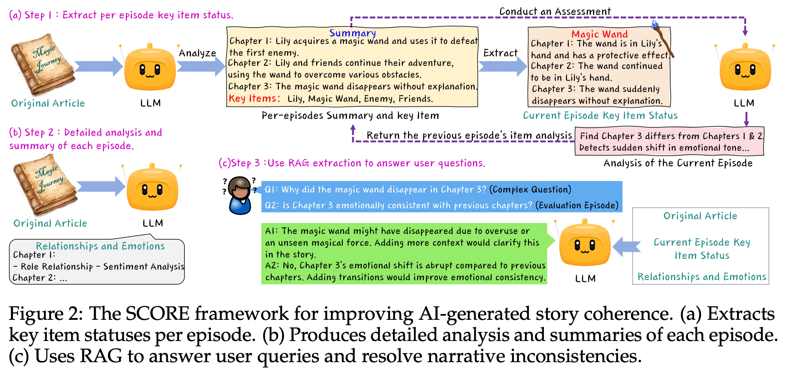

# SCORE: Story Coherence and Retrieval Enhancement



This repository contains the official implementation of **SCORE (Story Coherence and Retrieval Enhancement)**, introduced in:

> **Qiang Yi\*, Yangfan He\*, Jianhui Wang\*, Xinyuan Song, Shiyao Qian, Miao Zhang, Li Sun, Tianyu Shi.**  
> *SCORE: Story Coherence and Retrieval Enhancement for AI Narratives.*  
> arXiv preprint arXiv:2503.23512, 2025.  
> [[arXiv Link]](https://arxiv.org/abs/2503.23512)

---

## 🌟 Overview

**SCORE** is a lightweight LLM-based framework for evaluating and improving story coherence in AI-generated narratives. It consists of three key components:

- **Dynamic State Tracking**  
  Detects and corrects inconsistencies in the states of key items (e.g., objects that were destroyed but reappear).

- **Context-Aware Summarization**  
  Automatically generates structured episode summaries, capturing character actions, relationships, and emotional development.

- **Hybrid Retrieval**  
  Combines semantic similarity and sentiment alignment using a RAG-style approach for consistent multi-episode reasoning.

---

## 📄 Citation

If you use this codebase, please cite our work:

```bibtex
@article{yi2025score,
  title={SCORE: Story Coherence and Retrieval Enhancement for AI Narratives},
  author={Yi, Qiang and He, Yangfan and Wang, Jianhui and Song, Xinyuan and Qian, Shiyao and Zhang, Miao and Sun, Li and Shi, Tianyu},
  journal={arXiv preprint arXiv:2503.23512},
  year={2025}
}
